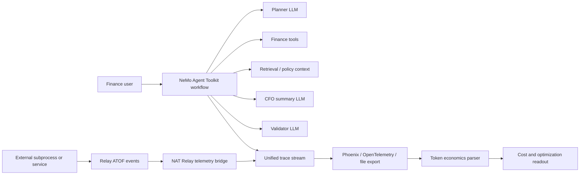

# Architecture



## Data Contract

The economics parser expects one normalized JSON object per span:

```json
{
  "trace_id": "run-001",
  "source": "nat",
  "stage": "planner",
  "event_type": "LLM_END",
  "model": "nvidia/nemotron-3-nano-30b-a3b",
  "prompt_tokens": 1380,
  "completion_tokens": 180,
  "reasoning_tokens": 0,
  "cached_tokens": 0,
  "latency_ms": 820,
  "success": true
}
```

Relay ATOF events should be normalized into the same shape before economics aggregation.

## Metrics

- `cost_usd`: token cost for a span.
- `total_tokens`: prompt + completion + reasoning tokens.
- `avg_cost_per_run_usd`: total cost divided by workflow runs.
- `avg_cost_per_success_usd`: total cost divided by successful runs.
- `retry_cost_usd`: cost for spans marked with `retry: true`.
- `token_amplification_ratio`: all workflow tokens divided by final CFO summary completion tokens.

